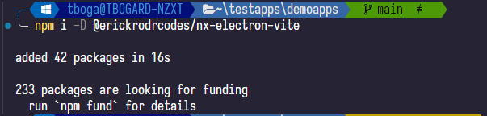
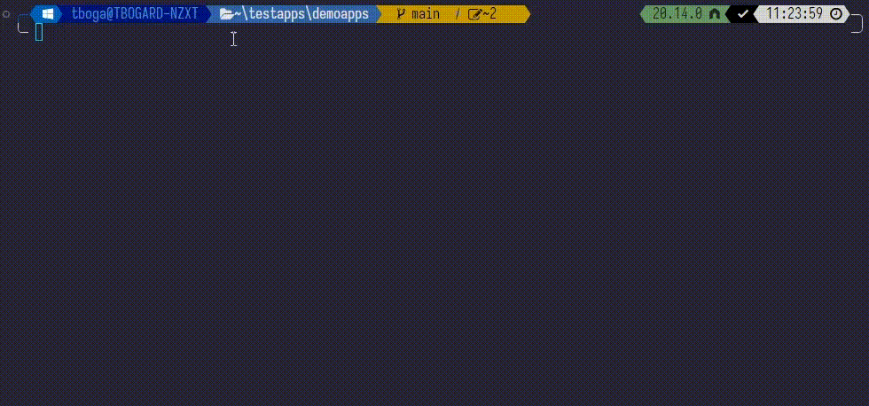

# nx-electron-vite

[](https://www.npmjs.com/package/@erickrodrcodes/nx-electron-vite)
[](https://github.com/erickrodrcodes/nx-plugins/actions?query=workflow%3ARelease)
[](https://github.com/semantic-release/semantic-release)

> Nx Plugin to generate, run, package and build [Electron](https://electronjs.org) projects inside your Nx workspace

## Contents

- [Features](#features)
- [Requirements and considerations](#requirements-and-considerations)
- [Setup](#setup)
- [Generators](#generators)
- [Executors](#executors)
- [Compatibility with Nx](#compatibility-with-nx)
- [Credits](#credits)
- [License](#license)

## Features

- Generates boilerplate code for your existing Nx applications in a way you can generate ElectronJS applications.

## Requirements and considerations

### Requirements

- ⚠️ It requires you to use a monorepo approach for it to work. At the moment of writting, it works under this approach.
- ⚠️ It requires you to use Vite as bundler for your React or Vue Applications, or to use a Vite webapp. Angular support will come soon.

### Considerations

**This plugin is intended for new projects**. It affects also how your workspace works as it will add the `"type":"module"` keyword on your workspace `package.json`, so if you have a large codebase it is strongly recommended split your application in a separate codebase and setup the plugin to run electron on it.

🚨 IMPORTANT: That said, workflows based on jest, cypress, playwright, or postcss might break. for this, you might want to change specific files having the extension `cjs` instead of `js`. The generator will parse some of this files for you, but if something breaks it will be needed to change extensions for certain js files and verify it works back as intended.

## Setup

in your existing monorepo, you can run on the root of your workspace:

```bash
npm i -D @erickrodrcodes/nx-electron-vite
```

If successful, you will see the package correctly installed



## Generators

### init

The `init` generator will help you to setup your existing project to be ready to use with electron.

If you run `nx g @erickrodrcodes/nx-electron-vite:init` without parameters, it will run an interactive setup for you

|                                                 |
| :---------------------------------------------: |
|       |
| Example of the output with the generator `init` |

In this example, the application `demoapp`

## Executors

Coming soon

## Compatibility with Nx

Every Nx plugin relies on the underlying Nx Workspace/DevKit it runs on. This table provides the compatibility matrix between major versions of Nx workspace and this plugin.

| Plugin Version | Nx Workspace version |
| -------------- | -------------------- |
| `>=v10.x.x`    | `>=v18.x.x`          |

## Credits

- The format of the readme page is based on the readme of [NxRocks](https://github.com/tinesoft/nxrocks) project of Tine Kondo

## License

Copyright (c) 2024-present Erick Rodriguez. Licensed under the MIT License (MIT)
