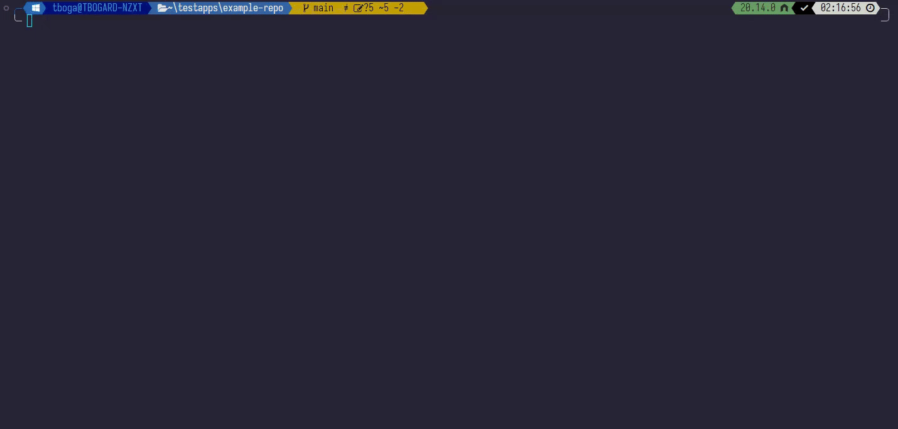
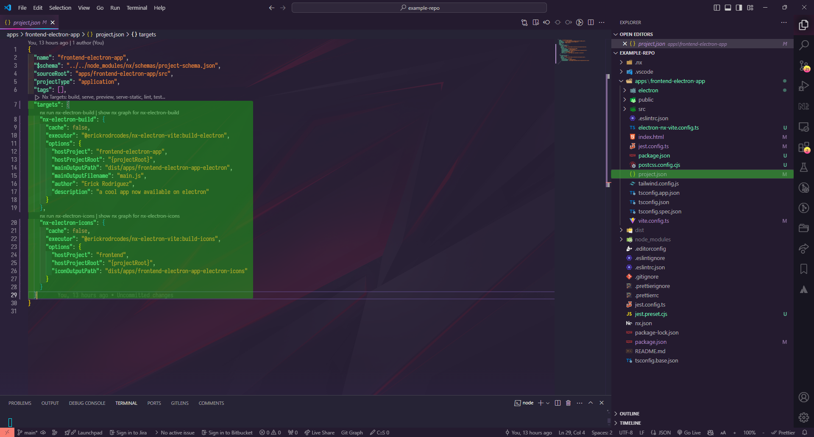

# nx-electron-vite

[](https://www.npmjs.com/package/@erickrodrcodes/nx-electron-vite)
[](https://github.com/erickrodrcodes/nx-plugins/actions?query=workflow%3ARelease)
[](https://github.com/semantic-release/semantic-release)

> Nx Plugin to generate, run, package and build [Electron](https://electronjs.org) projects inside your Nx workspace

## Contents

- [Features](#features)
- [Requirements and considerations](#requirements-and-considerations)
- [Setup](#setup)
- [Generators](#generators)
- [Executors](#executors)
- [Compatibility with Nx](#compatibility-with-nx)
- [Credits](#credits)
- [License](#license)

## Features

- Generates boilerplate code for your existing Nx applications in a way you can generate ElectronJS applications.

## Requirements and considerations

### Requirements

- ⚠️ It requires you to use a monorepo approach for it to work. At the moment of writting, it works under this approach.
- ⚠️ It requires you to use Vite as bundler for your React or Vue Applications, or to use a Vite webapp. Angular support will come soon.

### Considerations

**This plugin is intended for new projects**. It affects also how your workspace works as it will add the `"type":"module"` keyword on your workspace `package.json`, so if you have a large codebase it is strongly recommended split your application in a separate codebase and setup the plugin to run electron on it.

🚨 IMPORTANT: That said, workflows based on jest, cypress, playwright, or postcss might break. for this, you might want to change specific files having the extension `cjs` instead of `js`. The generator will parse some of this files for you, but if something breaks it will be needed to change extensions for certain js files and verify it works back as intended.

## Setup

in your existing monorepo, you can run on the root of your workspace:

```bash
nx add @erickrodrcodes/nx-electron-vite
```

If successful, you will see the package correctly installed

|                  |
| :--------------------------------------------: |
| _Expected result of the output of the command_ |

By using `nx add`, you are executing inherently the generator [Init](#init), which will add all the needed dependencies for this plugin to work.

You can also use your package manager and add `@erickrodrcodes/nx-electron-vite` to the list of `devDependencies`, and then run

`nx g @erickrodrcodes/nx-electron-vite:init`

to finally initialize the needed dependencies

## Generators

### init

The `init` generator will assist in installing the required dependencies for your project to run your applications with Vite and Electron. By default does not need to run with additional parameters

#### Available Parameters for the generator `init`

| Parameter                     | Required | Default Value | Description                                                                                                                                                                                                                                    |
| ----------------------------- | :------: | :-----------: | ---------------------------------------------------------------------------------------------------------------------------------------------------------------------------------------------------------------------------------------------- |
| skipPackageJson               |    ❌    |     false     | If set to true, it will not add required dependencies to your package.json                                                                                                                                                                     |
| skipInstallPluginDependencies |    ❌    |     false     | If set to true, it will not install dependencies with your package manager. If `skipPackageJson` is set to `true`, `skipInstallPluginDependencies` will not run as it depends on the new dependencies to perform the installation of packages. |
| skipFormat                    |    ❌    |     false     | If set to true, it will not format the files generated for your project                                                                                                                                                                        |

#### usage

| action                                                                  | command                                                                           |
| ----------------------------------------------------------------------- | --------------------------------------------------------------------------------- |
| default usage (add dependencies, install them, format files)            | `nx g @erickrodrcodes/nx-electron-vite:init`                                      |
| do not format the output files                                          | `nx g @erickrodrcodes/nx-electron-vite:init --skipFormat=true`                    |
| do not add dependencies                                                 | `nx g @erickrodrcodes/nx-electron-vite:init --skipPackageJson=true`               |
| add dependencies, but do not perfom the package manager install command | `nx g @erickrodrcodes/nx-electron-vite:init --skipInstallPluginDependencies=true` |

### setup-project

The `setup-project` generator will prepare your Vite frontend application (being one generated by Nx with vite such @nx/react, @nx/vite or @nx/vue, or a custom one) to be used along with nx-electron-vite. The good news is that this generator is fully interactive, and contain the needed steps to guide you in a easy manner to setup your electron setup for your frontend application.

**⚠️ Warning:**
By running this generator, it will affect your workspace by adding the `"type":"module"` in your main package.json which is located at the root of your workspace. [Please read the considerations of such action before your proceed](#considerations)

#### Assisted Mode

if you run `nx g @erickrodrcodes/nx-electron-vite:setup-project` without parameters, it will run a wizard where you will be asked the project you want to use, and other public information regarding your app as it is needed by Electron.

|             |
| :---------------------------------------------------------------------: |
| Assisted mode for `nx g @erickrodrcodes/nx-electron-vite:setup-project` |

#### Parameters

If you don't want to use the assisted mode, you can pass parameters to the command line. **All the parameters are required**.

| Parameter   | Alias | Required | Description                                             |
| ----------- | :---: | :------: | ------------------------------------------------------- |
| hostProject |  hp   |    ✅    | The name of the host project you will use with electron |
| name        |   n   |    ✅    | A Human readable name for your Electron Application     |
| author      |   a   |    ✅    | Author of the electron application                      |
| description |   d   |    ✅    | A brief description of the electron application         |

Example:

```
nx g @erickrodrcodes/nx-electron-plugin:setup-project --hostProject=MyReactViteProject --name="My Cool Electron App" --author="Erick Rodriguez" --description="A cool electron app using react"
```

As a consequence, your application will have two new targets to build and create icons, which also runs the respective executors for you. (highglighted on green):

|  |
| :--------------------------------------------------------------------------------------------: |
| New targets for creating icons for your app and building the electron app in your project.json |

## Executors

For applications that are integrated with vite, such @nx/react, @nx/vue or @nx/vite webapps, the usage of `nx serve {app}` will cascade in the internal execution of the react app into electron:


The served application has all the same quirks like hot reload and others offered by, in this case, the React DOM application via `@nx/react`.

The additional new targets simplify the implementation of the executors to build applications and build your icons.

### build-electron

the executor `build-electron` is placed with its own target in your project as showcased above. It is not recommended to change any parameter unless you want to change something on the build process that might alter the final outcome.

When running your target project with `build-electron`, it will build first your application and then prepare the final part of the application to ship it with a distributable setup.

I'm placing the options of the executor so you are aware of the required parameters it needs to operate

| Parameter          | Required | Default Value                                                                                    | Description                                                             |
| ------------------ | :------: | ------------------------------------------------------------------------------------------------ | ----------------------------------------------------------------------- |
| hostProject        |    ✅    | provided when a project is initialized via `nx g @erickrodrcodes/nx-electron-vite:setup-project` | The project you will be hosting in your electron app                    |
| hostProjectRoot    |    ✅    | {projectRoot}                                                                                    | The root directory of the project you will host with electron           |
| mainOutputPath     |    ✅    | provided when a project is initialized via `nx g @erickrodrcodes/nx-electron-vite:setup-project` | Path used for the main output for the build of the electron application |
| mainOutputFilename |    ✅    | "main.js"                                                                                        | the name of your main process file in your electron application.        |
| author             |    ✅    | provided when a project is initialized via `nx g @erickrodrcodes/nx-electron-vite:setup-project` | the author of the application. Used when building your application.     |
| description        |    ✅    | provided when a project is initialized via `nx g @erickrodrcodes/nx-electron-vite:setup-project` | the description of the application in human language.                   |

### build-icons

## Compatibility with Nx

Every Nx plugin relies on the underlying Nx Workspace/DevKit it runs on. This table provides the compatibility matrix between major versions of Nx workspace and this plugin.

| Plugin Version | Nx Workspace version |
| -------------- | -------------------- |
| `>=v10.x.x`    | `>=v18.x.x`          |

## Credits

- The format of the readme page is based on the readme of [NxRocks](https://github.com/tinesoft/nxrocks) project of Tine Kondo

## License

Copyright (c) 2024-present Erick Rodriguez. Licensed under the MIT License (MIT)
