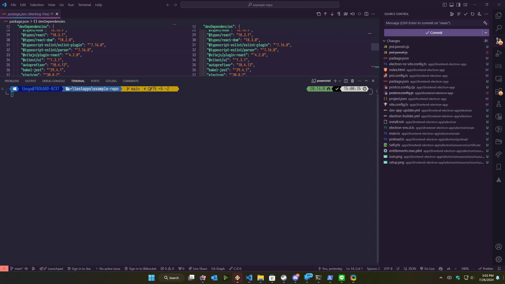

# nx-electron-vite

|                      |                           |                                                                         |                     |                               |                             |                                                |
| :------------------: | :-----------------------: | :---------------------------------------------------------------------: | :-----------------: | :---------------------------: | :-------------------------: | :--------------------------------------------: |
| [Home](../README.md) | [Features](./features.md) | [Requirements and Considerations](./requirements-and-considerations.md) | [Setup](./setup.md) | [Generators](./generators.md) | [Executors](./executors.md) | [Compatibility with Nx](./compatibility-nx.md) |

## Executors

For applications that are integrated with vite, such `@nx/react`, `@nx/vue` or `@nx/vite` webapps, the usage of the command `nx serve {app}` will cascade in the internal execution of the hosted application into electron:

The served application has all the same quirks like hot reload and others offered by, in this case, the React DOM application via `@nx/react`.

The additional new targets simplify the implementation of the executors to build applications and build your icons.

### build-electron

the executor `build-electron` is placed with its own target in your project as showcased above. It is not recommended to change any parameter unless you want to change something on the build process that might alter the final outcome.

When running your target project with `build-electron`, it will build first your application and then prepare the final part of the application to ship it with a distributable setup.

I'm placing the options of the executor so you are aware of the required parameters it needs to operate

| Parameter          | Required | Default Value                                                                                    | Description                                                             |
| ------------------ | :------: | ------------------------------------------------------------------------------------------------ | ----------------------------------------------------------------------- |
| hostProject        |    ✅    | provided when a project is initialized via `nx g @erickrodrcodes/nx-electron-vite:setup-project` | The project you will be hosting in your electron app                    |
| hostProjectRoot    |    ✅    | {projectRoot}                                                                                    | The root directory of the project you will host with electron           |
| mainOutputPath     |    ✅    | provided when a project is initialized via `nx g @erickrodrcodes/nx-electron-vite:setup-project` | Path used for the main output for the build of the electron application |
| mainOutputFilename |    ✅    | "main.js"                                                                                        | the name of your main process file in your electron application.        |
| author             |    ✅    | provided when a project is initialized via `nx g @erickrodrcodes/nx-electron-vite:setup-project` | the author of the application. Used when building your application.     |
| description        |    ✅    | provided when a project is initialized via `nx g @erickrodrcodes/nx-electron-vite:setup-project` | the description of the application in human language.                   |

### build-icons

|                      |                           |                                                                         |                     |                               |                             |                                                |
| :------------------: | :-----------------------: | :---------------------------------------------------------------------: | :-----------------: | :---------------------------: | :-------------------------: | :--------------------------------------------: |
| [Home](../README.md) | [Features](./features.md) | [Requirements and Considerations](./requirements-and-considerations.md) | [Setup](./setup.md) | [Generators](./generators.md) | [Executors](./executors.md) | [Compatibility with Nx](./compatibility-nx.md) |

Copyright (c) 2024-present Erick Rodriguez. Licensed under the MIT License (MIT)

