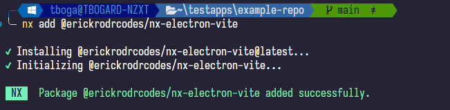

# nx-electron-vite

<center>

|                      |                           |                                                                         |                     |                               |                             |                                                |
| :------------------: | :-----------------------: | :---------------------------------------------------------------------: | :-----------------: | :---------------------------: | :-------------------------: | :--------------------------------------------: |
| [Home](../README.md) | [Features](./features.md) | [Requirements and Considerations](./requirements-and-considerations.md) | [Setup](./setup.md) | [Generators](./generators.md) | [Executors](./executors.md) | [Compatibility with Nx](./compatibility-nx.md) |

</center>

## Setup

in your existing monorepo, you can run on the root of your workspace:

```bash
nx add @erickrodrcodes/nx-electron-vite
```

If successful, you will see the package correctly installed

|                |
| :--------------------------------------------: |
| _Expected result of the output of the command_ |

By using `nx add`, you are executing inherently the generator [`Init`](./generators.md#init), which will add all the needed dependencies for this plugin to work.

You can also use your package manager and add `@erickrodrcodes/nx-electron-vite` to the list of `devDependencies`, and then run

`nx g @erickrodrcodes/nx-electron-vite:init`

to finally initialize the needed dependencies

<center>

|                      |                           |                                                                         |                     |                               |                             |                                                |
| :------------------: | :-----------------------: | :---------------------------------------------------------------------: | :-----------------: | :---------------------------: | :-------------------------: | :--------------------------------------------: |
| [Home](../README.md) | [Features](./features.md) | [Requirements and Considerations](./requirements-and-considerations.md) | [Setup](./setup.md) | [Generators](./generators.md) | [Executors](./executors.md) | [Compatibility with Nx](./compatibility-nx.md) |

Copyright (c) 2024-present Erick Rodriguez. Licensed under the MIT License (MIT)

</center>
