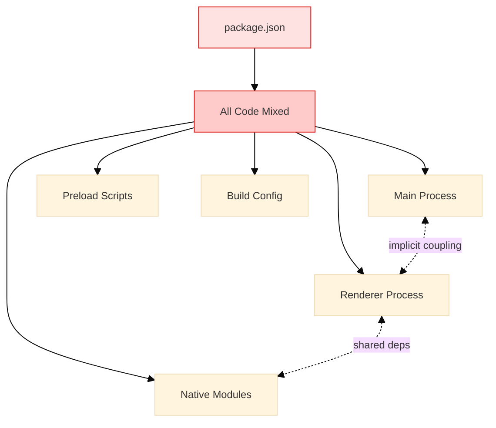
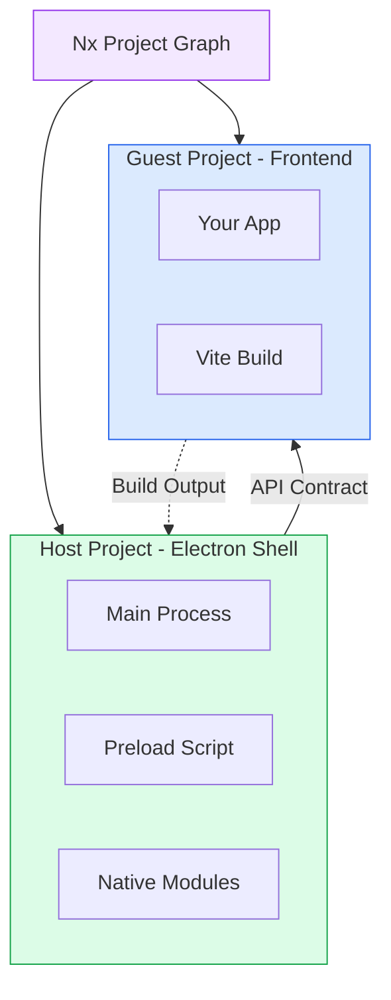
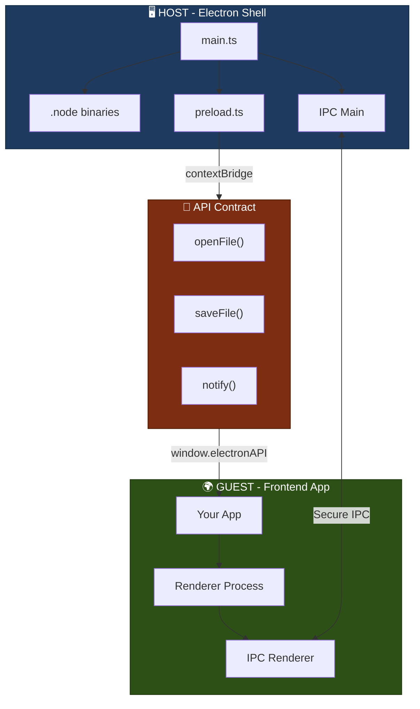
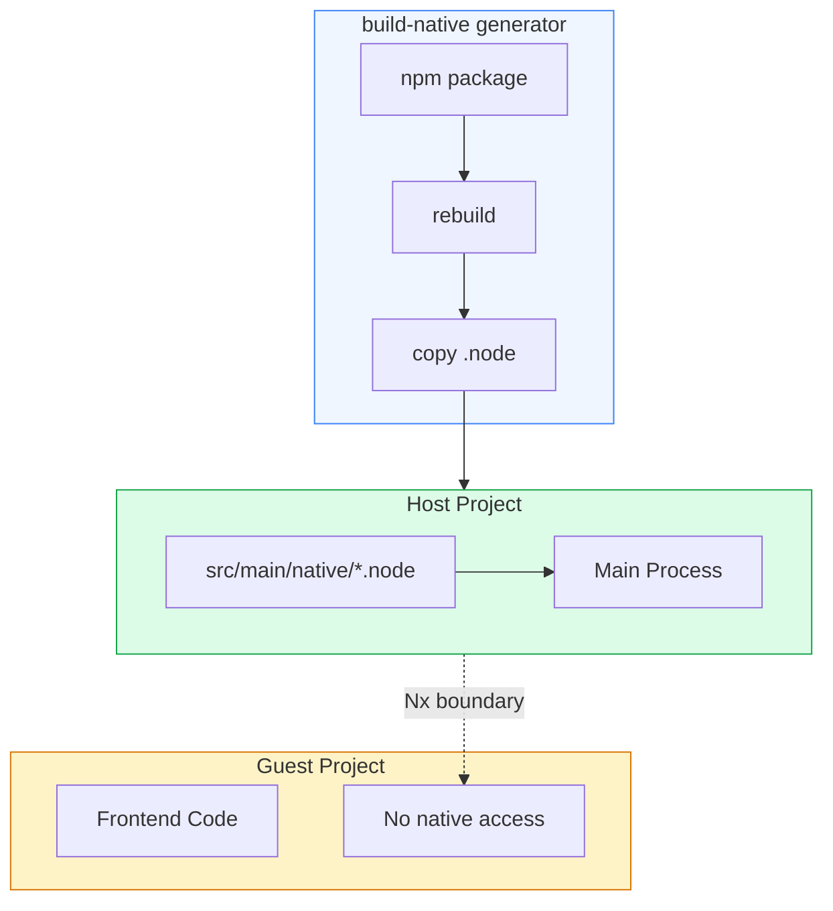
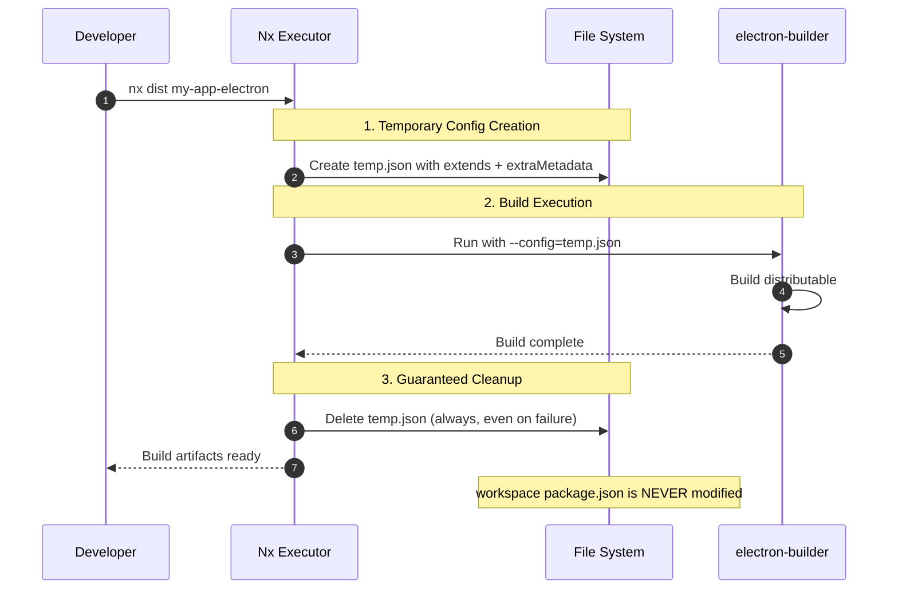
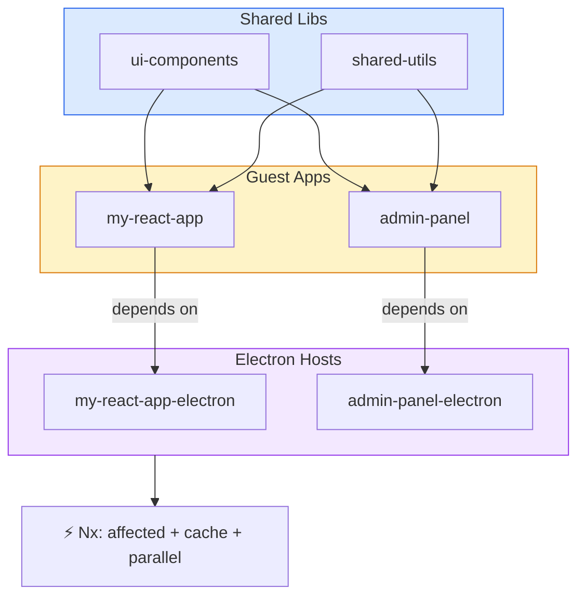
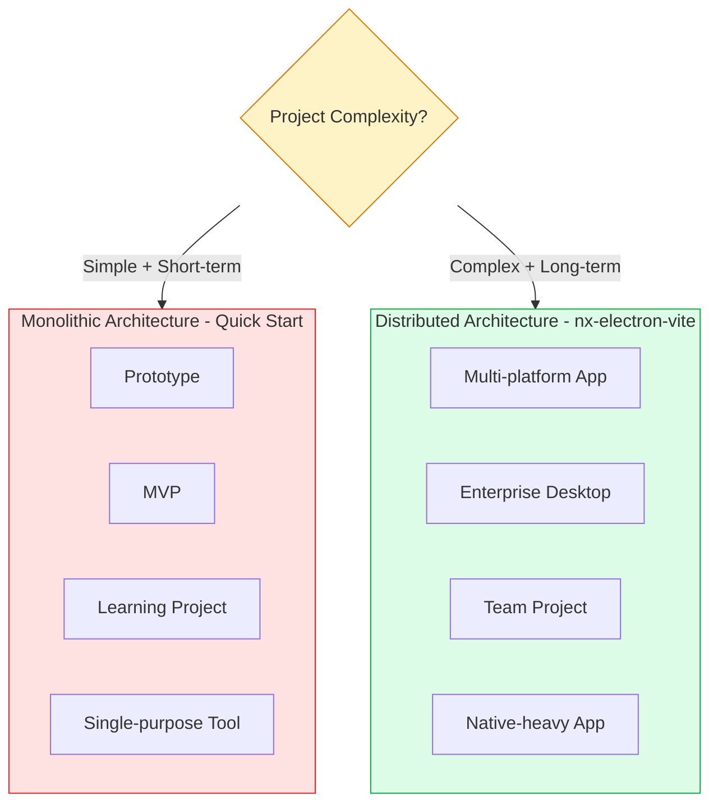

# Architecture Deep Dive

This section provides a deeper look into the design and concepts behind `nx-electron-vite`.

## Motivations

This plugin was built to address several fundamental challenges in modern desktop app development within a monorepo context:

### Separation of Concerns

Many tools create a monolithic Electron project where the UI and main process logic are tightly coupled. However, `nx-electron-vite` enforces a clean separation by using a "host" (the Electron shell) and "guest" (your web app) model. This leads to better maintainability and allows for independent testing.

### Modern Tooling Integration

By leveraging Vite, you get a lightning-fast development experience with near-instant hot-reloading for both the main and renderer processes, while maintaining the architectural boundaries that prevent common pitfalls.

### Monorepo-First Design

Built specifically for Nx monorepo environments, it leverages the workspace's project graph to enable powerful features like cached builds, dependency management, and shared libraries that scale across multiple applications and teams. Unlike standalone Nx projects, the plugin requires a monorepo context to provide its architectural benefits and workspace orchestration capabilities.

### Native Module Complexity

Traditional approaches force developers into complex bundler configurations and runtime workarounds to handle native Node.js modules. `nx-electron-vite` solves this architecturally by establishing clear boundaries where native dependencies belong exclusively in the host project, eliminating the common anti-pattern of native modules accidentally leaking into renderer processes.

## Architectural Philosophy

`nx-electron-vite` represents a fundamentally different architectural approach to Electron development, prioritizing **explicit separation of concerns** over **unified simplicity**. This design choice comes with specific trade-offs that make it suitable for certain contexts while potentially excessive for others.

## Monolithic vs. Distributed Architecture

### Traditional Monolithic Electron Architecture



Most Electron development approaches follow an **ad-hoc monolithic pattern** where architectural decisions emerge organically rather than from principled design:

- **Script-Driven Development**: Projects rely heavily on npm scripts that accumulate over time (`start`, `package`, `make`, `publish`, plus variants for different platforms, architectures, and development modes). These scripts often become complex shell commands that embed build logic, making the development workflow opaque and difficult to maintain or debug
- **Implicit Coupling**: Main process, renderer process, and preload scripts exist within the same project boundary without explicit contracts or separation mechanisms. Dependencies, build configurations, and runtime concerns become intertwined through proximity rather than architectural intent
- **Configuration Drift**: Each project develops its own unique build pipeline, bundler configuration, and dependency management approach. What starts as "simple" often evolves into project-specific complexity that becomes difficult to replicate or maintain
- **Reactive Problem-Solving**: Architectural decisions are made in response to immediate problems (build failures, native module conflicts, framework incompatibilities) rather than proactive design, leading to accumulated technical debt and fragile workarounds

While this approach can work for simple scenarios, it creates fundamental architectural limitations as projects evolve:

**Architectural Limitations:**

- **Prevents Modularity**: Main process, renderer process, and build configurations are intertwined within a single project, making it difficult to work on one part without affecting others
- **Code Reuse Challenges**: Frontend developed with the assumption it will always live inside the Electron shell becomes difficult to reuse in other contexts
- **Scalability Issues**: As applications grow, monolithic codebases become "big balls of mud" without clear boundaries
- **Framework Lock-in**: Monolithic Electron tools create significant framework constraints despite claims of broad support. While they provide first-class integration for popular frameworks like React and Vue, they often struggle with others like Svelte, Angular, or SolidJS. This limitation stems from their architectural need to pre-configure build pipelines, bundler settings, and hot-reload mechanisms for specific framework patterns. For example, [Electron Forge's framework integration](https://www.electronforge.io/guides/framework-integration) officially supports only React, React with TypeScript, and Vue 3, requiring manual configuration and complex workarounds for other frameworks. Similarly, [electron-builder's boilerplate recommendations](https://www.electron.build/) focus primarily on React-based templates. A Svelte renderer in a React-focused monolithic Electron setup requires complex workarounds and often loses features like proper HMR or optimized builds. The tight coupling between the Electron wrapper and frontend tooling means adapting to frameworks with different compilation models, file structures, or development servers becomes an exercise in fighting the tool's assumptions rather than leveraging its capabilities
- **Lack of Standardization**: Unified tooling approaches tend to be ever-changing between projects, as there is no clear standard for Electron development. Each project often implements its own custom build pipeline, bundler configuration, and native module handling, leading to inconsistent patterns and making knowledge transfer between projects difficult
- **Inefficient Build Cycles**: Changes anywhere often require rebuilding and re-testing the entire application
- **Poor Native Module Handling**: Single-package structure blurs the line between Node.js main process and browser renderer process, leading to build failures and runtime crashes

### Distributed Architecture (`nx-electron-vite`)

`nx-electron-vite` implements a **distributed architecture** with explicit project boundaries:

<div style="display: flex; justify-content: center;">



</div>

**Core Architectural Patterns:**

- **Multi-Project Structure**: Host (Electron shell) and Guest (frontend) exist as independent projects
- **Explicit Dependency Graph**: Nx project graph defines clear relationships and build order
- **Formal Contracts**: Communication through well-defined preload script interfaces
- **Isolated Dependency Management**: Each project maintains its own dependencies and build configuration

**Architectural Benefits:**

- **Principled Separation with Enforced Boundaries**: Unlike monolithic approaches where separation relies on developer discipline, `nx-electron-vite` uses Nx's project graph to enforce architectural boundaries at the tooling level. The host/guest separation isn't just a conceptual pattern—it's a structural requirement that prevents accidental coupling and ensures clean interfaces between Electron shell logic and frontend application code
- **Multi-Target Deployment through Nx Executors**: Because `nx-electron-vite` maintains complete framework agnosticism and architectural separation, the guest application can leverage Nx's full ecosystem of executors for different deployment targets—web builds via Vite executors, mobile deployment through Capacitor/Ionic executors, and desktop packaging via electron-builder executors. The agnostic nature of `nx-electron-vite` means Nx can roll out the appropriate executor dependencies for development, testing, and deployment of each target without architectural conflicts or Electron-specific constraints
- **Architectural Native Module Isolation**: Native Node.js modules are explicitly contained within the host project's dependency tree and source structure, preventing the common monolithic pattern where renderer processes accidentally import Node.js modules. This isn't achieved through bundler workarounds or runtime checks—Nx's project boundaries make it architecturally impossible for the guest application to access native dependencies, eliminating an entire class of runtime errors
- **Monorepo-Scale Electron Applications**: The distributed architecture scales naturally to multiple Electron applications within a single Nx workspace, sharing common libraries, design systems, and build configurations while maintaining independent release cycles. Nx's affected command system ensures that changes to shared dependencies only rebuild the applications that actually depend on them
- **True Framework Agnosticism - The Game Changer**: The distributed architecture eliminates framework lock-in entirely, representing a **fundamental paradigm shift** in Electron development. Since the guest application exists as a completely independent Nx project, it can use **any framework supported by Nx**—React, Angular, Vue, Svelte, SolidJS, Qwik, or even custom setups—without requiring Electron-specific adaptations, pre-configured templates, or workarounds.

  **This is truly agnostic architecture**: Unlike monolithic tools that provide [limited official framework support](https://www.electronforge.io/guides/framework-integration) (typically React and Vue only), `nx-electron-vite` leverages [Nx's comprehensive framework ecosystem](https://nx.dev/showcase/example-repos/add-svelte), including community plugins like [@nxext/svelte](https://www.npmjs.com/package/@nxext/svelte) that provide full-featured support for any framework. Each framework retains its **complete native development experience**, build optimizations, and tooling ecosystem without compromise. For instance, a Svelte application gets full SvelteKit features, proper HMR, and Vite optimizations, while an Angular project maintains its CLI capabilities and build pipeline. The host project simply consumes the built guest application as a static asset, making the framework choice **completely invisible to the Electron layer**—this is what makes the architecture truly framework-agnostic rather than just "multi-framework compatible"

- **Standardized Development Patterns**: `nx-electron-vite` provides a consistent, generator-driven workflow that standardizes Electron development across projects and teams. Unlike the ad-hoc, project-specific build configurations common in monolithic setups, `nx-electron-vite` ensures that native module handling, icon generation, project setup, and build processes follow the same patterns regardless of the underlying frontend framework or team preferences. This standardization facilitates knowledge transfer between projects, reduces onboarding time for new team members, and creates predictable development workflows that scale across organizations

**Architectural Costs:**

- **Paradigm Shift from Ad-hoc to Principled Development**: Teams accustomed to the immediate gratification of monolithic development must adapt to `nx-electron-vite`'s structured, generator-driven approach. This represents a fundamental shift from reactive problem-solving to proactive architectural design, requiring developers to think in terms of project boundaries, explicit contracts, and coordinated builds rather than quick fixes and manual workarounds
- **Multi-Project Coordination Overhead**: The distributed architecture requires explicit coordination between host and guest projects through Nx's dependency graph and build orchestration. Unlike monolithic setups where everything exists in the same project space, developers must understand project relationships and ensure proper build sequencing, though Nx automates much of this complexity
- **Generator-Driven Workflow**: Common tasks like adding native modules, generating icons, or setting up new Electron applications require running specific generators rather than manual file manipulation. While this ensures consistency and best practices, it represents a departure from the ad-hoc development patterns where developers directly modify files and configurations as needed
- **Tooling Investment**: The architecture necessitates understanding and configuring Nx-specific tooling (generators, executors, project configuration) rather than simple npm scripts. This requires teams to invest in Nx expertise and potentially adjust existing CI/CD pipelines to leverage Nx's caching and affected command capabilities, though the long-term benefits typically justify this initial investment

## Core Architectural Patterns

### Host/Guest Model

The fundamental architectural pattern is the **Host/Guest separation**:



- **Guest Project**: This is your existing, standard frontend application that runs as the renderer process. While architecturally decoupled from Electron, it may optionally interact with Electron-specific functionality through the well-defined APIs exposed by the preload script
- **Host Project**: This is a new application, created by the plugin's `setup-project` generator. It acts as the Electron shell, responsible for creating the application window, running the main process logic, and exposing controlled APIs to the guest project through the preload script
- **Communication Layer**: The "contract" between the two applications is clearly defined through the preload script, which prevents unintended coupling and makes the integration points explicit

### What This Means for You:

1.  **Truly Framework Agnostic & Reusable Frontend - The Revolutionary Approach**: Your frontend application remains **completely framework-native and deployment-agnostic**—this is the game-changing differentiator. It can be developed, tested, and served as a standalone web application using your framework's standard tooling without any Electron-specific code or dependencies. The same codebase can be deployed to web, mobile (via Capacitor), and desktop targets without architectural modifications.

    ```mermaid
    %%{init: {'theme': 'base', 'themeVariables': { 'fontSize': '12px' }}}%%
    flowchart LR
        CODE["Your Frontend"] --> WEB["Web"]
        CODE --> MOBILE["Mobile"]
        CODE --> DESKTOP["Desktop"]

        WEB --> W_OUT["CDN / Vercel"]
        MOBILE --> M_OUT["App Stores"]
        DESKTOP --> D_OUT[".exe .dmg .AppImage"]

        style CODE fill:#dcfce7,stroke:#16a34a
        style WEB fill:#dbeafe,stroke:#2563eb
        style MOBILE fill:#fef3c7,stroke:#d97706
        style DESKTOP fill:#f3e8ff,stroke:#9333ea
    ```

    **What makes this truly agnostic**: Unlike traditional Electron tools that require framework-specific templates, build configurations, or Electron-aware adaptations baked into your codebase, `nx-electron-vite` treats your frontend application as a **completely independent entity**. Whether you're using React hooks, Angular services, Vue composition API, Svelte stores, or SolidJS signals—your core application code remains **framework-pure** without Electron-specific build tooling or dependencies. However, to leverage desktop-specific features, you'll need a basic understanding of Electron's IPC pattern to communicate with the main process and react to native events.

    **Understanding the Integration Layer**: The preload script exposes APIs to the `window` object, and your frontend code calls these APIs when needed. This is a minimal but intentional integration point:

    ::: code-group

    ```js
    // Example: Optional desktop APIs exposed by preload script
    if (window.electronAPI?.openFile) {
      // Desktop-specific functionality available
      const file = await window.electronAPI.openFile();
    } else {
      // Fallback for web deployment
      const file = await webFileAPI.selectFile();
    }
    ```

    :::

    This approach ensures your frontend remains portable across all deployment targets while optionally leveraging desktop capabilities when available.

2.  **Independent Development Cycles**: Teams can work on frontend features and Electron shell functionality with complete independence. Frontend developers use their framework's native development server and tooling without any Electron overhead, while the Electron team focuses on native integrations, security policies, and desktop-specific features. This separation dramatically improves development velocity as each team can iterate at their own pace using their preferred tools.

3.  **Explicit Integration Contracts**: The communication interface between host and guest is formally defined through the preload script, creating a versioned API that prevents accidental coupling. This architectural boundary makes desktop integration points explicit, testable, and maintainable, while ensuring that frontend code remains portable and framework-agnostic.

4.  **Architectural Automation through Nx Tooling**: The plugin provides purpose-built generators and executors that understand and enforce the host/guest relationship. These tools automate complex tasks like native module integration, icon generation, and coordinated builds while maintaining architectural boundaries. Rather than relying on developer discipline, the tooling makes it impossible to violate the separation principles, ensuring clean and maintainable project structures.

### Native Module Architecture

Unlike monolithic Electron projects that typically rely on complex bundler configurations, runtime checks, and fragile workarounds to prevent native module conflicts, `nx-electron-vite` implements a **structurally sound solution** through architectural design.



The plugin's `build-native` generator provides an explicit, traceable workflow: it uses the official `@electron/rebuild` tool to compile native modules against the correct Electron ABI, then copies the resulting `.node` binary directly into the host application's source tree at `src/main/native/`. This approach eliminates the common anti-pattern where renderer processes accidentally import Node.js modules by making such imports architecturally impossible—the guest application has no access to the host project's dependency tree.

This represents a fundamental shift from **reactive problem-solving** (bundler exclusions, runtime guards, manual build scripts) to **proactive architectural prevention**. Rather than detecting and handling native module conflicts when they occur, the distributed architecture prevents unnecessary workarounds: the guest project exists in a separate Nx project with its own `package.json` and `node_modules`, meaning it literally cannot `import` or `require` native modules that only exist in the host project's dependency tree. Nx keeps separation of concerns clear, providing a maintainable and reliable path for native dependency management.

### Workspace Integrity Architecture

A critical but often overlooked architectural consideration in Electron development is **workspace integrity**—how the build process interacts with your workspace's root configuration files. Traditional Electron boilerplates and build tools frequently modify the workspace `package.json` during the build process, creating several architectural problems:

**Problems with Traditional Approaches:**

- **Build-Time Mutation**: Many electron-builder setups temporarily inject `main` entry points, `author`, `name`, and `version` fields directly into the workspace `package.json`, then attempt to restore the file afterward. This creates race conditions when multiple builds run simultaneously and risks permanent file corruption if builds fail unexpectedly
- **Git Status Pollution**: Developers frequently see uncommitted changes to `package.json` after builds, leading to accidental commits of build artifacts or confusion about what actually changed in the workspace
- **CI/CD Fragility**: Build pipelines that modify workspace files must implement careful cleanup logic, and any interruption (timeout, cancellation, failure) can leave the workspace in an inconsistent state that breaks subsequent builds
- **Monorepo Conflicts**: In workspaces with multiple Electron applications, parallel builds competing to modify the same `package.json` create unpredictable failures and require complex locking mechanisms

**`nx-electron-vite`'s Architectural Solution:**

Rather than modifying workspace files, `nx-electron-vite` implements a **temporary configuration composition pattern** that preserves complete workspace integrity:



1. **Isolated Configuration Generation**: During the build process, a temporary `electron-builder.{projectName}.temp.json` file is created at the workspace root. Each project gets its own uniquely-named temp file, enabling true parallel builds. This file uses electron-builder's `extends` feature to inherit from your project's `electron-builder.yml` while injecting build-specific metadata through `extraMetadata`

2. **Metadata Injection Without Mutation**: Application metadata (`name`, `version`, `author`, `description`, `main` entry point) is passed through the temporary configuration rather than being injected into workspace files. The original `package.json` and project configurations remain completely untouched

3. **Guaranteed Cleanup**: The temporary configuration file is automatically deleted after build completion, regardless of success or failure. This ensures the workspace is always in a clean state, with no residual build artifacts or uncommitted changes

4. **Parallel Build Safety**: Because each build operates through temporary files that extend project-specific configurations, multiple Electron applications in the same workspace can build simultaneously without conflicts or coordination requirements

**Architectural Significance:**

This approach embodies the distributed architecture's core principle of **explicit boundaries and isolated concerns**. Just as the host/guest separation prevents unintended coupling between Electron shell logic and frontend code, the temporary configuration pattern prevents the build process from coupling with workspace state. The workspace remains a stable, read-only reference during builds, enabling:

- **Predictable CI/CD Pipelines**: Builds are truly stateless with no cleanup requirements or failure recovery logic
- **Clean Development Workflow**: `git status` never shows build-related modifications to workspace files
- **True Parallelization**: Multiple `nx dist` targets can execute simultaneously without coordination
- **Reliable Incremental Builds**: Nx's caching works correctly because workspace files don't change between builds

## Architectural Integration with Nx

The architectural patterns described above—host/guest separation, explicit contracts, and native module isolation—are not just conceptual designs but are actively enforced and optimized by Nx's workspace orchestration capabilities.

### Project Graph Orchestration

Nx's project graph transforms the distributed architecture from a manual coordination challenge into an automated build orchestration system:



- **Dependency-Aware Builds**: Nx understands that the Electron host project depends on the guest application's build output. When you modify the frontend, Nx automatically rebuilds the guest project before building the host, ensuring the Electron app always consumes the latest frontend assets
- **Affected Command Intelligence**: Changes to shared libraries automatically trigger rebuilds of only the affected Electron applications and their dependencies, rather than rebuilding the entire workspace
- **Cross-Project Caching**: Build artifacts, test results, and lint outputs are cached across the entire dependency graph. A clean frontend build that hasn't changed can be restored from cache in seconds, dramatically improving iteration speed

### Workspace-Scale Benefits

The architectural separation enables workspace-level capabilities that would be impossible in monolithic setups:

- **Multi-Application Management**: Multiple Electron applications can coexist in the same workspace, each wrapping different frontend projects while sharing common host configurations, native modules, and build pipelines
- **Unified Development Experience**: Whether working on a React web app, an Angular desktop application, or a Node.js API, all projects share consistent commands (`nx build`, `nx test`, `nx lint`) and development workflows
- **Shared Infrastructure**: Common libraries, design systems, and build configurations can be shared across all applications in the workspace, with Nx ensuring that changes propagate correctly through the dependency graph

## Architectural Trade-offs

The choice between distributed and monolithic architectures fundamentally depends on project complexity and the need for separation of concerns across moving pieces.



### When Distributed Architecture (`nx-electron-vite`) Excels

**Complex Projects Requiring Clear Separation:**

- **Multi-Component Systems**: Applications where frontend logic, native integrations, and Electron shell concerns need independent development cycles and clear boundaries
- **Team Coordination**: Multiple developers or teams working simultaneously on different aspects (UI/UX team on frontend, systems team on native modules, DevOps on packaging)
- **Cross-Platform Requirements**: Frontend applications that must support web deployment alongside desktop, requiring framework-agnostic architecture
- **Nx Monorepo Context**: Organizations using Nx monorepos where the plugin can leverage workspace-level features like project graphs, shared libraries, and cross-project caching. Note that `nx-electron-vite` is specifically designed for monorepo environments and does not support standalone Nx projects
- **Heavy Native Integration**: Applications requiring multiple native modules, OS-specific APIs, or complex native dependency management where architectural isolation prevents runtime conflicts
- **Disciplined Solo Development**: Individual developers or architects who value proper separation of concerns and want to clearly differentiate moving parts, using the distributed architecture as an ideal playground to architect applications with explicit boundaries even in single-person projects
- **Knowledge Building**: Developers seeking to understand separation of concerns, component interaction patterns, and architectural best practices benefit from `nx-electron-vite`'s explicit structure, which teaches proper boundaries and communication patterns even in small setups

### When Monolithic Architecture Remains Practical

**Simple Projects with Minimal Complexity:**

- **Single-Purpose Tools**: Straightforward applications with limited scope where the overhead of distributed architecture exceeds its benefits
- **Rapid Prototyping**: Proof-of-concepts, MVPs, or experimental projects where development speed trumps architectural rigor and where the code is expected to be disposable
- **Limited Architectural Requirements**: Projects led by developers who prefer immediate solutions over long-term maintainability, or where the application will remain simple indefinitely
- **Electron-Exclusive Applications**: Desktop-only tools with no multi-platform requirements, where the guest/host separation provides no architectural advantage
- **Learning Projects**: Educational or personal projects where understanding Electron fundamentals is more important than production-ready architecture patterns
- **Resource-Constrained Teams**: Small teams or solo developers who cannot invest time in learning Nx concepts and prefer to accept technical debt in exchange for immediate development velocity

## Conclusion

The `nx-electron-vite` architecture represents a paradigm shift from ad-hoc, reactive development to principled, proactive architecture. Rather than allowing architectural patterns to emerge organically through accumulated workarounds and project-specific solutions, `nx-electron-vite` enforces explicit separation of concerns, framework agnosticism, and tooling-enforced boundaries from the outset.

This architectural approach transforms common Electron development pain points—native module conflicts, framework lock-in, build complexity, and scaling challenges—from ongoing maintenance burdens into solved problems through structural design. The distributed architecture doesn't just provide better separation; it makes poor architectural decisions impossible through Nx's project graph enforcement.

The choice between monolithic and distributed approaches fundamentally comes down to accepting short-term convenience versus investing in long-term architectural sustainability. `nx-electron-vite` excels in environments where code quality, maintainability, multi-platform deployment, and team coordination benefits justify the initial investment in understanding principled architecture patterns.

Teams should choose `nx-electron-vite` when they value predictable, scalable development patterns over immediate simplicity, and when they're committed to building applications that can evolve and scale without accumulating architectural debt.
